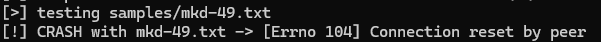
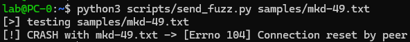

# Fuzzing Process

## How Radamsa Mutates Input

Radamsa applies randomized transformations that commonly stress parsers:

- Length expansion and truncation
- Byte-level corruption
- Token duplication/removal
- Control character and delimiter injection
- Encoding-like distortions

For line-oriented protocols like FTP, these mutations can break parser assumptions around command tokenization, line termination, and buffer boundaries.

## Core Commands

```bash
radamsa input.txt
radamsa -n 100 input.txt
radamsa -n 1000 corpus/mkd.txt -o samples/mkd-%n.txt
```

## Fuzzing Strategy

- Seed with syntactically valid FTP commands
- Focus first on high-risk parser entry points (`USER`, `PASS`, `MKD`)
- Run in batches to preserve reproducibility
- Log each payload with an index so crash-causing input can be replayed
- Monitor target process availability after each send

## Python Harness Integration

Use a sender script to connect, send one fuzzed command, and classify response health.

#### This script:
- Opens a TCP connection to the FTP service  
- Receives the initial banner  
- Sends one fuzzed payload per connection  
- Classifies the response (`ok`, `no-response`, `timeout`)  
- Helps identify potential crash conditions  

```python
# scripts/send_fuzz.py
import socket
import sys
from pathlib import Path

TARGET_IP = "192.168.199.136"
TARGET_PORT = 21
TIMEOUT = 3

def send_payload(payload: bytes):
    s = socket.socket(socket.AF_INET, socket.SOCK_STREAM)
    s.settimeout(TIMEOUT)
    s.connect((TARGET_IP, TARGET_PORT))

    banner = s.recv(1024)

    # Ensure proper FTP format
    if not payload.endswith(b"\r\n"):
        payload += b"\r\n"

    s.sendall(payload)

    try:
        resp = s.recv(1024)
        status = "ok" if resp else "no-response"
    except socket.timeout:
        status = "timeout"
        resp = b""

    s.close()
    return banner, resp, status

if __name__ == "__main__":
    payload_file = Path(sys.argv[1])
    print(f"[>] testing {payload_file}")

    payload = payload_file.read_bytes()

    try:
        banner, resp, status = send_payload(payload)
        print(f"[+] payload={payload_file.name} status={status}")
        print(f"[+] banner={banner!r}")
        print(f"[+] response={resp!r}")

    except Exception as e:
        print(f"[!] CRASH with {payload_file.name} -> {e}")
```

During fuzzing, the script monitors the target server’s behavior when processing mutated inputs. Most responses correspond to expected protocol-level errors (e.g., `500 command not understood` or `331 password required`). However, certain inputs trigger abnormal behavior, indicating potential flaws in input handling or parsing logic.

In this case, the payload `mkd-49.txt` caused a crash:

```text
[!] CRASH with mkd-49.txt -> [Errno 104] Connection reset by peer
```



The error `Connection reset by peer` suggests that the server process either crashed internally or forcibly terminated the connection due to an unhandled condition. Unlike standard protocol errors, this behavior indicates a failure outside normal input validation paths.

This indicates that the server abruptly closed the connection, which is often a sign of:
- Improper input validation
- Memory corruption
- Potential buffer overflow

To confirm the issue, the payload was executed multiple times:



The crash was reproducible, confirming that this input consistently triggers abnormal behavior.

This payload is therefore flagged as interesting for further analysis, as it may reveal a vulnerability in the FTP server implementation.

From a fuzzing perspective, this type of behavior is particularly valuable, as it may indicate:

- A boundary condition violation (e.g., buffer overflow or underflow)
- Improper string handling
- Unexpected state transitions in the FTP command parser

Further analysis (e.g., debugging or memory inspection) would be required to determine the exact root cause.

## Batch Execution Example

Generates multiple fuzzed payloads and sends them sequentially to the target service.

```bash
mkdir -p samples logs

radamsa -n 500 corpus/mkd.txt -o samples/mkd-%n.txt

for f in samples/mkd-*.txt; do
  python3 scripts/send_fuzz.py "$f" >> logs/mkd-run.log 2>&1
done
```

#### This process enables:
- Automated execution of large input sets without manual intervention  
- Increased coverage of edge cases and malformed inputs  
- Systematic identification of crashes and anomalous behavior  
- Reproducible testing conditions through indexed payloads  

#### Useful for:
- Automated fuzzing campaigns
- Reproducibility and debugging

## Netcat-Style One-Off Testing

For quick manual probes:

```bash
radamsa corpus/user.txt | nc 192.168.56.20 21
```

Use this for spot checks only. For meaningful analysis, prefer indexed file-based execution so crashes can be reproduced.

## Fuzzing Hygiene

- Restart service automatically between failed runs when possible
- Store payload hash and filename with every anomaly
- Separate transport failures from target crashes
- Re-test crash candidates multiple times to rule out noise

## Conclusion

The implemented fuzzing workflow successfully identified abnormal behavior in the target FTP server. By combining structured input mutation (Radamsa), automated delivery (Python harness), and batch execution, the approach enabled efficient exploration of the server’s input handling robustness.

The discovery of a reproducible crash demonstrates the effectiveness of the methodology and highlights the importance of fuzz testing in uncovering potential vulnerabilities in network services.
