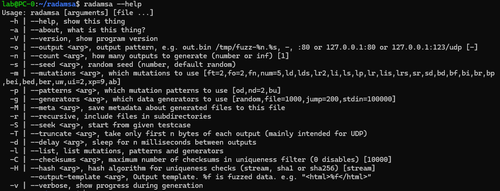
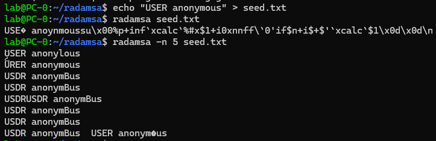
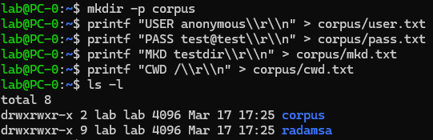
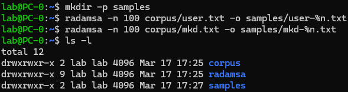

# Setup and Installation

## Lab Topology

- Attacker host: Windows with WSL (recommended) or Linux VM
- Target host: Windows VM running vulnerable FTP service
- Network: host-only or isolated internal lab segment
- Monitoring: Event Viewer, optional debugger (WinDbg/x64dbg), packet capture

## Install Radamsa (WSL Recommended)

### Option 1: Package Manager (if available)

```bash
sudo apt update

git clone https://gitlab.com/akihe/radamsa.git
cd radamsa
make
sudo cp bin/radamsa /usr/local/bin/

radamsa --help
```



## Verify Basic Operation

Verifies that Radamsa is correctly mutating a valid FTP command.  
Instead of random data, it performs mutation-based fuzzing, generating malformed but still partially valid inputs that can reach deeper parsing logic.

```bash
echo "USER anonymous" > seed.txt
radamsa seed.txt
radamsa -n 5 seed.txt
```




## Prepare Seed Inputs for FTP Fuzzing

Creates a small corpus of valid FTP commands with proper \r\n termination.
Using protocol-compliant inputs is critical, as it allows mutated payloads to bypass basic validation and interact with real parsing logic.

```bash
mkdir -p corpus
printf "USER anonymous\\r\\n" > corpus/user.txt
printf "PASS test@test\\r\\n" > corpus/pass.txt
printf "MKD testdir\\r\\n" > corpus/mkd.txt
printf "CWD /\\r\\n" > corpus/cwd.txt
```



## Generate Initial Mutated Samples

Generates multiple mutated payloads from the seed corpus and stores them for reuse.
Saving samples enables reproducibility, making it easier to identify which specific input triggers a crash or abnormal behavior.

```bash
mkdir -p samples
radamsa -n 100 corpus/user.txt -o samples/user-%n.txt
radamsa -n 100 corpus/mkd.txt -o samples/mkd-%n.txt
```



## Windows Notes

- If attacker scripts run on Windows and Radamsa runs in WSL:
  - Generate files under WSL and access via `\\wsl$` path
  - Or run both generation and sender script in WSL for simpler path handling
- Keep target service isolated from production networks
- Snapshot target VM before fuzzing for fast recovery
